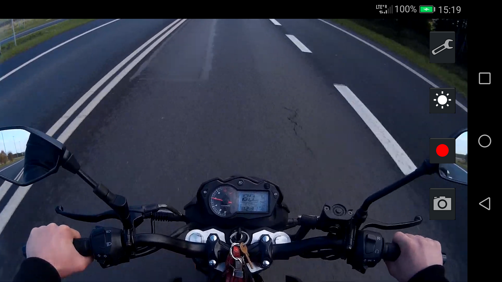

# GPS2SRT
This app records video and saves your speed and location. Speed is saved as subtitles in [SRT](https://en.wikipedia.org/wiki/SubRip) format and is visible when you play back the video. The path traveled is saved to [GPX](https://en.wikipedia.org/wiki/GPS_Exchange_Format) file and can be displayed by other software.

Latest build of the app can be downloaded here: [GPS2SRT-release.apk](https://github.com/mareksuma1985/GPS2SRT/blob/master/GPS2SRT/build/outputs/apk/debug/GPS2SRT-debug.apk) or from Apkpure: [Speed recorder](https://apkpure.com/pl/pl.bezzalogowe.gps2srt).